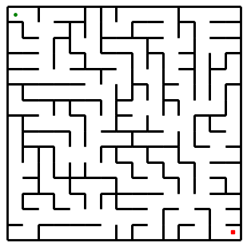

# Mazewright

A Python package for generating and visualizing perfect mazes using various algorithms.

## Features

- **Multiple algorithms**: Recursive Backtracker, Prim's, and Kruskal's algorithms
- **Multiple export formats**: PNG, SVG, and ASCII art output
- **Clean API**: Simple, intuitive interface for maze generation
- **Visualization**: Built-in matplotlib rendering with customizable styling
- **CLI tool**: Generate mazes from the command line
- **Type hints**: Full type annotations for better IDE support
- **Well-tested**: Comprehensive test suite ensuring perfect maze generation

## Installation

```bash
pip install mazewright
```

For development:
```bash
git clone https://github.com/sebastian-griego/Mazewright.git
cd Mazewright
pip install -e ".[dev]"
```

## Quick Start (30 seconds)

### Python API

```python
from mazewright import generate
from mazewright.visualize import save

# Generate a 20x20 maze using Prim's algorithm
maze = generate(20, 20, algorithm="prim")

# Save to file
save(maze, "my_maze.png")
```

### Command Line

```bash
# Generate a maze with default settings
python -m mazewright

# Customize size and algorithm
python -m mazewright --rows 30 --cols 30 --algo kruskal --out maze.png

# Export to different formats
python -m mazewright --out maze.svg      # SVG (scalable vector graphics)
python -m mazewright --out maze.txt      # ASCII art
python -m mazewright --format ascii      # Force ASCII output

# Fine-tune appearance
python -m mazewright --rows 15 --cols 20 --cell-size 25 --wall-width 3
```

## API Reference

### Core Functions

```python
# Generate a maze
maze = generate(rows=10, cols=10, algorithm="backtracker")

# Available algorithms:
# - "backtracker": Recursive backtracker (DFS)
# - "prim": Prim's algorithm (frontier growth)
# - "kruskal": Kruskal's algorithm (union-find)
```

### Maze Object

```python
from mazewright import Maze, Wall

# Create empty maze
maze = Maze(rows=10, cols=10)

# Access cells
cell = maze[0, 0]

# Check walls
if cell.has_wall(Wall.NORTH):
    print("Wall to the north")

# Carve passages manually
maze.carve(0, 0, 0, 1)  # Connect (0,0) to (0,1)
```

### Visualization

```python
from mazewright.visualize import render, save, save_svg, save_ascii

# Render to matplotlib figure
fig = render(maze, cell_size=1.0, wall_width=2.0)

# Save to PNG file
save(maze, "output.png", cell_size=20, wall_width=2, dpi=100)

# Save to SVG (scalable vector graphics)
save_svg(maze, "output.svg", cell_size=20, wall_width=2)

# Save or display as ASCII art
ascii_str = save_ascii(maze)  # Returns string
save_ascii(maze, "output.txt")  # Saves to file
print(ascii_str)  # Display in terminal
```

## Example Output

Running `python -m mazewright --rows 15 --cols 15 --algo prim` generates mazes like:



## Algorithms

### Recursive Backtracker
- Produces long, winding passages
- Low branching factor
- Implemented as iterative DFS for efficiency

### Prim's Algorithm
- More uniform branching
- Grows from a frontier of cells
- Good balance of corridors and branches

### Kruskal's Algorithm
- Most uniform distribution
- Uses union-find data structure
- Treats maze as a graph problem

## Development

### Setup
```bash
# Install with dev dependencies
pip install -e ".[dev]"

# Install pre-commit hooks
pre-commit install
```

### Testing
```bash
pytest
```

### Code Quality
```bash
# Format code
black mazewright tests

# Lint
ruff check mazewright tests
```

## Architecture

```
mazewright/
├── __init__.py         # Public API
├── maze.py             # Core data structures
├── visualize.py        # Rendering engine
├── algorithms/
│   ├── backtracker.py  # Recursive backtracker
│   ├── prim.py         # Prim's algorithm
│   └── kruskal.py      # Kruskal's with union-find
└── __main__.py         # CLI entry point
```

## Future Enhancements (v0.2+)

- **More algorithms**: Wilson's, Aldous-Broder, Hunt-and-Kill
- **Masks**: Non-rectangular grids, shaped mazes
- **Themes**: Preset visual styles
- **3D mazes**: Multi-level maze generation

## License

MIT

## Version

v0.2.0 - Initial release with core functionality